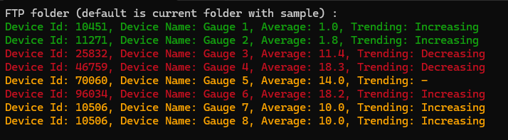

# Code Challenge
You need input the the FTP files folder in the command line, default is the the current folder with sample , such as:
```
	c:\ftp\files
```

it get all devices from the folder which is contains "Device" in the file name and ends with ".csv";
it get all data from the folder which is contains "Data" in the file name and ends with ".csv";

the test result is as following:



